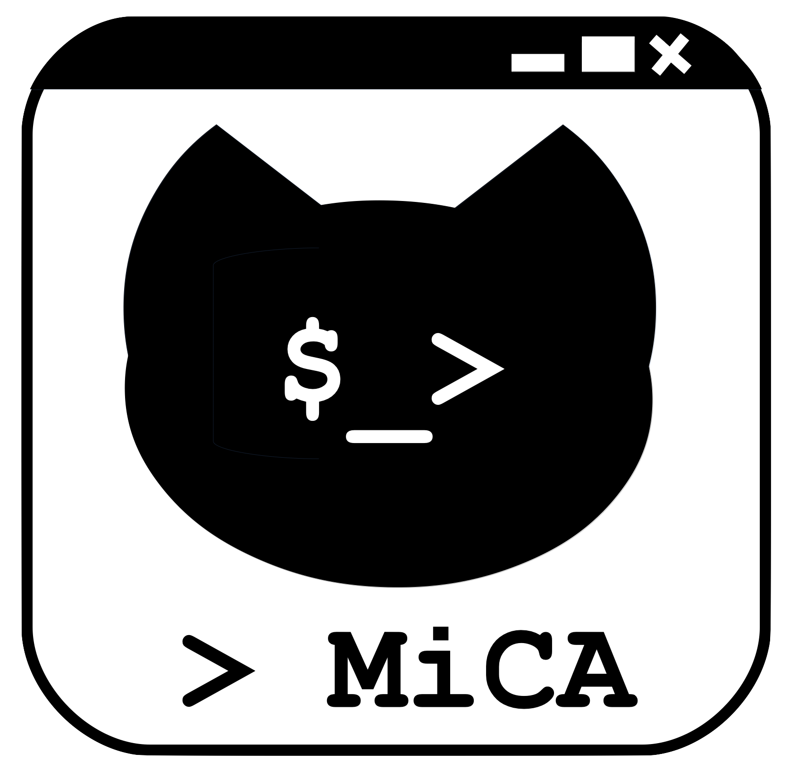

# The MiCA-Framework
A Framework for the Microservice-based Simulation of Cyber Attacks. Created as [my](https://github.com/zinklandi) Master-Thesis at the [Laboratory for Information Security](https://seclab.othr.de) at the [OTH Regensburg](https://www.oth-regensburg.de).

<div stlye="width:100%;float:left;">
 

</div>

<a href="https://github.com/mica-framework">--> Go to GitHub to see the project</a>

## Introduction
The goal of the MiCA-Framework is to provide a simple framework and an easy to implement infrastructure to be able to simulate cyber attacks within research projects. Therefore custom cyber attacks can be developed and simulate through the MiCA-Framework on multiple victim-clients as requested.

This frameworks purpose is to support IT-Security researchers on simulating and analyzing cyber attacks. Therefore we do not provide custom cyber attacks! It shall not be abused through third parties by providing tools for potential malicious hackers.

Using Docker provides the ability to run and distribute attacks on multiple devices, which have Docker installed. This also enables a detailed analysis of the implemented cyber attacks, through providing the same environment on each victim thanks to the used docker containers.

If you like to use this framework feel free to use it within your researches. If you'd like to reference this project, please use the following BibTex-Reference:
```
@misc{
  author = {Zinkl, Andreas},
  title = {The MiCA-Framework},
  year = {2019},
  publisher = {GitHub},
  journal = {GitHub Repository},
  howpublished = {\url{https://github.com/mica-framework}}
}
```

## Requirements
To be able to run this framework on your local environment, the following requirements need to be fulfilled:
- Docker Client or Docker Toolbox (Installers can be found <a href="https://docs.docker.com/install/">here</a>)
- Python 3.5 (or newer)

## Integration
Integrating the framework into your research environment requires two steps:
1. Installation & Configuration of the MiCA-Server
2. Installation of the MiCA-Agents

### ***MiCA-Server***:
The installation of the **MiCA-Server** can be processed by going through the following steps:
1. Clone the repo: `git clone git@github.com/mica-framework/server.git`
1. Go to the folder `server` and edit the following files as need for your system:
    1. docker-compose.yml
    1. config.yml
1. Finally start the services by running the command `docker-compose up --build`

**Hints:** 
- `--build` should be run on the first startup. I'd recommend to use it every time, if
you changed something on the server
- Currently, only an Influx database is supported for storing the logs. If you do not have an Influx instance, use the following command to run a local instance as a docker container:
```docker-compose up -f docker-compose.yml -f ./docker/influxdb.yml --build```

### ***MiCA-CLI***:
You can run the MiCA-CLI by just downloading or cloning the repo and finally running the `mica-cli.py` file. An exectuable is not available till now (but is in progress!).

**WARNING**: The CLI is currently only working properly under unix-terminals. Windows consoles like powershell and cmd do not decode a the text properly. Fixing this, is also in progress!

Here's a short hint, how the CLI can be executed on your system:
```bash
# 1 - Start by creating a virutal environment within the CLI project
python3 -m venv .env

# 2 - Activate the virutal environment
. .env/bin/activate     # on unix devices
. .env/scripts/activate # on windows

# 3 - Now install the dependencies
pip install -r requirements.txt

# 4 - Run the cli
python3 mica-cli.py
```

### ***MiCA-Agent***:
Running the MiCA-Agent is simple, but currently there's only a working Windows Installer-Version of the Installer-Script. That means, you need to download the binary for linux and execute it manually on your system.
If you're running windows, then the following command will install the MiCA-Agent on your system and registers the agent-startup within your autostart:

```bash
curl https://raw.githubusercontent.com/mica-framework/tools/master/agent-installation/install_mica_agent.sh --output install.sh && ./install.sh && rm ./install.sh
```

## Contribution / Development
This project was published as Open Source to share the framework with all IT-Security researchers and to create a framework which may be improved through different areas of use. I hope that you like what you get with this framework, but also feel free to create issues about errors, problems or things you like to see.
If you want to be a part or contribute to this project, just feel free to do it!

The Project was published through the popular MIT-License, to create the best conditions for all of you to contribute to this project as well as use it within your researches!

## References
Thanks to all Open Source Developers for sharing their tools and software! I've
mentioned the used Tools for the creation of this landing page and framework below:
- <a href="https://github.com/rapid7/metasploit-framework">Metasploit Framework by @rapid7</a>
- <a href="https://github.com/KrauseFx/markdown-to-html-github-style">Markdown to HTML Tool by @krausefx</a>
- <a href="https://github.com/pwaller/pyfiglet">PyFiglet for the Intro-Page of the CLI by @pwaller</a>
- <a href="https://github.com/CITGuru/PyInquirer">PyInquirer for the CLI-Interaction by @CITguru</a>

## License

MIT License

Copyright (c) 2019 MiCA-Framework

Permission is hereby granted, free of charge, to any person obtaining a copy
of this software and associated documentation files (the "Software"), to deal
in the Software without restriction, including without limitation the rights
to use, copy, modify, merge, publish, distribute, sublicense, and/or sell
copies of the Software, and to permit persons to whom the Software is
furnished to do so, subject to the following conditions:

The above copyright notice and this permission notice shall be included in all
copies or substantial portions of the Software.

THE SOFTWARE IS PROVIDED "AS IS", WITHOUT WARRANTY OF ANY KIND, EXPRESS OR
IMPLIED, INCLUDING BUT NOT LIMITED TO THE WARRANTIES OF MERCHANTABILITY,
FITNESS FOR A PARTICULAR PURPOSE AND NONINFRINGEMENT. IN NO EVENT SHALL THE
AUTHORS OR COPYRIGHT HOLDERS BE LIABLE FOR ANY CLAIM, DAMAGES OR OTHER
LIABILITY, WHETHER IN AN ACTION OF CONTRACT, TORT OR OTHERWISE, ARISING FROM,
OUT OF OR IN CONNECTION WITH THE SOFTWARE OR THE USE OR OTHER DEALINGS IN THE
SOFTWARE.